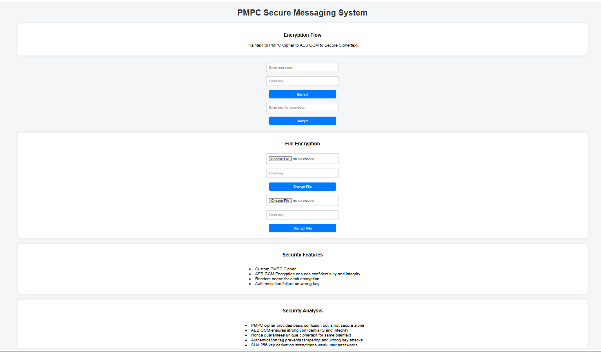
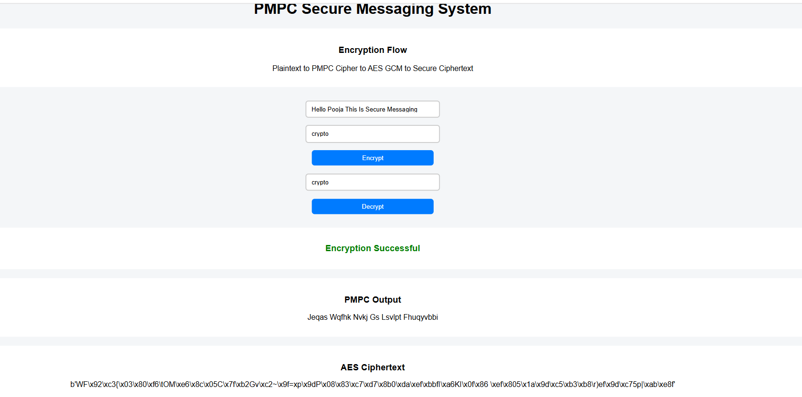
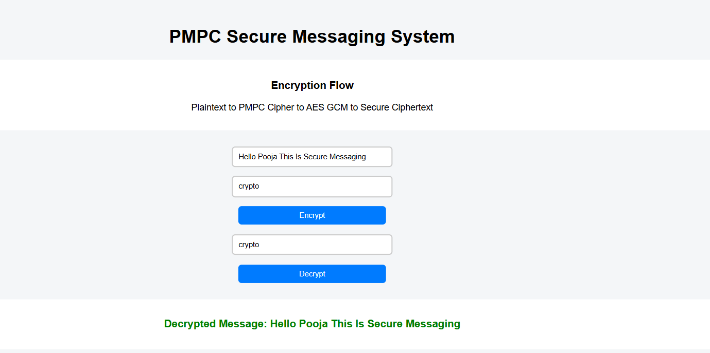
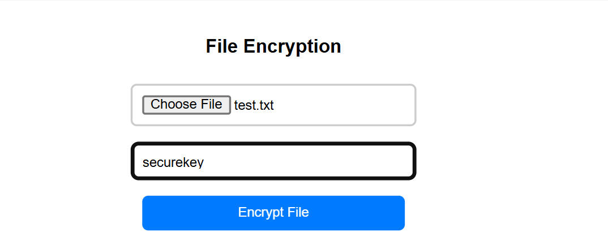
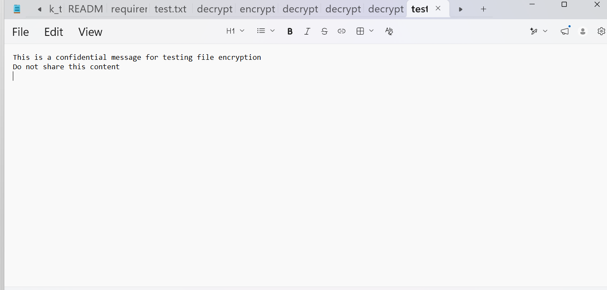
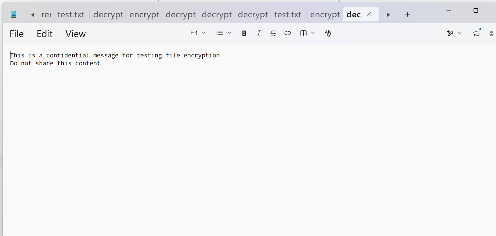

# PMPC Secure Messaging System

## Description
This project implements a hybrid cryptographic system combining a custom Prime Mirror Polyalphabetic Cipher (PMPC) with AES-GCM encryption to provide secure text and file communication.

## Features
- Custom PMPC encryption and decryption
- AES-GCM encryption for confidentiality and integrity
- Case-preserving encryption
- File encryption and decryption support
- Secure key derivation using SHA-256
- Portable encrypted files with embedded nonce
- Error handling for wrong key and tampering

## Screenshots

### Main Interface

### Text Encryption Output

### Text Decryption Result

### File Encryption Process

### Original File Content

### File Decryption Result

## How It Works
Plaintext → PMPC → AES-GCM → Ciphertext  
Ciphertext → AES-GCM Decrypt → PMPC Decrypt → Plaintext  

## File Encryption Flow
1. Upload a text file  
2. PMPC encrypts file content  
3. AES-GCM encrypts with nonce + authentication  
4. Encrypted file is downloaded  

## File Decryption Flow
1. Upload encrypted file  
2. AES-GCM decrypts using stored nonce  
3. PMPC decrypts content  
4. Original file is restored  

## Security Features
- AES-GCM ensures confidentiality and integrity
- Random nonce prevents pattern attacks
- Authentication tag prevents tampering
- SHA-256 strengthens weak keys

## Technologies Used
- Python
- Flask
- Cryptography Library

## How to Run

1. Install dependencies  
pip install flask cryptography  

2. Run the application  
python app.py  

3. Open browser  
http://127.0.0.1:5000  

## Author
Pooja
